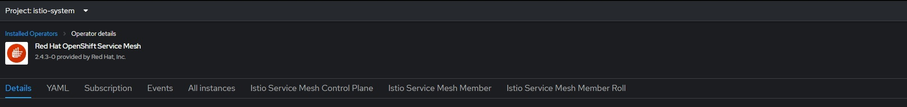
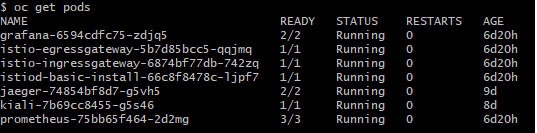
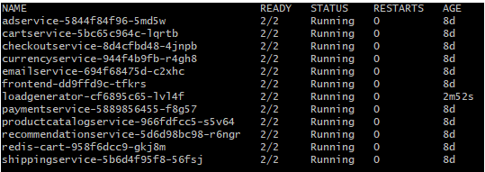
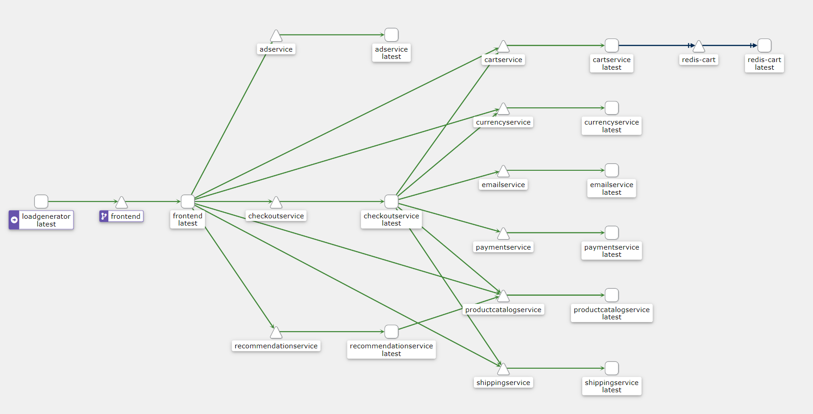
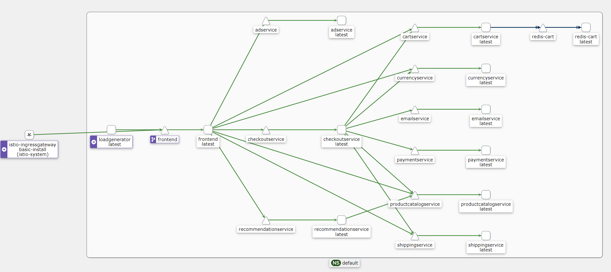

# Introduction
This repository was forked from [GoogleCloudPlatform/microservices-demo](https://github.com/GoogleCloudPlatform/microservices-demo). 

This repo was created for me to explore microservices, container networking, and Istio service mesh on the OpenShift platform.
The steps differ from the original repository as that was done in the GCP Kubernetes environment, this will be in OpenShift
Below, you'll find a comprehensive overview of the steps I followed to incorporate Istio Service Mesh into this microservices application, which has been transformed into a practical guide for your reference 

In this guide, you'll find step-by-step instructions to set up and configure Istio Service Mesh on OpenShift.

All the yaml code in this guide can be found in the openshift folder in this repository
## Prerequisites

Before you begin, ensure you have the following prerequisites:

- An OpenShift sandbox environment.
- Basic knowledge of containers and Kubernetes.

The instructions in this guide are based on OpenShift version 4.12.16.

## Installing Operators

To set up a service mesh and enhance observability, follow these steps to install crucial operators on your OpenShift cluster:

1. **Red Hat OpenShift Service Mesh**:
   - OpenShift's version of Istio service mesh.

2. **Kiali Operator**:
   - Real-time service mesh monitoring and visualization.
   - Generation of service dependency graphs.
   - Identification of security vulnerabilities and traffic monitoring.

3. **OpenShift Elasticsearch Operator**:
   - Centralized log aggregation for service mesh logs.
   - Powerful log searching and analysis capabilities.
   - Ensures scalability and resilience of Elasticsearch clusters.

4. **Red Hat OpenShift Distributed Tracing Platform**:
   - Provides visibility into request flow between services.
   - Identifies performance bottlenecks and latency issues.
   - Assists in troubleshooting by offering detailed tracing information.

## Setting up the Service Mesh Control-Plane

1. Create a new project/namespace called `istio-system`.

   

2. Navigate to the service mesh operator in the `istio-system` project and create a new Istio Service Mesh Control Plane using the provided YAML code.

   ```yaml
    kind: ServiceMeshControlPlane
    apiVersion: maistra.io/v2
    metadata:
    name: basic
    namespace: istio-system
    spec:
    version: v2.4
    tracing:
        type: Jaeger
        sampling: 10000
    policy:
        type: Istiod
    telemetry:
        type: Istiod
    addons:
        jaeger:
        install:
            storage:
            type: Memory
        prometheus:
        enabled: true
        kiali:
        enabled: true
        grafana:
        enabled: true
    ...
3. Create a service mesh member roll, this specifies which project/namespace istio will be looking at
   ```yaml
    kind: ServiceMeshMemberRoll
    apiVersion: maistra.io/v1
    metadata:
    name: default
    namespace: istio-system
    spec:
    members:
        - <name of your working project/namespace>

    ...

To check if your service mesh is running as expected 
Run 
```bash
    oc get pods  
```
on your istio-system project this is what it should look like this



## Deploying the Microservices Containers

1. Navigate to the OpenShift folder in this repository and run the following command:

```bash
    oc apply -f openshift-manifests.yaml
```

2. The YAML template was copied over from the Google Cloud release folder; however, some changes were made to accommodate the OpenShift environment. These are the two main changes:

- This line specifies that we are deploying our container in the default and in the application group named `istio-demo`. You can think of application groups as namespaces within namespaces, serving as another layer of organization:

  ```yaml
  labels:
    app.kubernetes.io/part-of: istio-demo
  ```

- This line is very important as it specifies that the Istio controller will be looking for this line to inject the sidecar proxy envoy. It works differently compared to Kubernetes:

  ```yaml
  annotations:
    sidecar.istio.io/inject: 'true'
  ```

3. Run `oc get pods` to confirm the status of the deployment. It should show 2/2, where one pod is for the container, and the other is for the envoy proxy.



4. Navigate to Kiali, which can be found at the top right corner. With Kiali, we can clearly see the flow of traffic and can easily spot any error flows.



## Configuring the Ingress

Now, we will configure the gateway and virtual services to expose our application.

Make sure to replace `<subdomain_of_your_openshift_cluster>` with the actual subdomain of your OpenShift cluster.

1. Create a route for the `istio-ingressgateway` service in the `istio-system` namespace:

```yaml
apiVersion: v1
kind: Route
metadata:
  name: istio-demo
spec:
  host: istio-demo.apps.<subdomain_of_your_openshift_cluster>
  port:
    targetPort: http2
  to:
    kind: Service
    name: istio-ingressgateway
    weight: 100
  wildcardPolicy: None
```
2.	Create a gateway with the below yaml code
```yaml
apiVersion: networking.istio.io/v1beta1
kind: Gateway
metadata:
  name: istio-gateway
  namespace: istio-system
spec:
  selector:
    istio: ingressgateway
  servers:
  - hosts:
    - '*.apps.<subdomain_of_your_openshift_cluster>’
    port:
      name: http2
      number: 80
      protocol: HTTP
```
3.	Create a virtual service pointing to our frontend service in the default namespace
```yaml
apiVersion: networking.istio.io/v1beta1
kind: VirtualService
metadata:
  name: frontend
  namespace: default
spec:
  gateways:
  - istio-system/istio-gateway
  hosts:
  - istio-demo.apps. .<subdomain_of_your_openshift_cluster>
  http:
  - route:
    - destination:
        host: frontend
        port:
          number: 80
```
## Conclusion

Congratulations! With these configurations, you have successfully set up an ingress gateway for your demo microservices. You can now access your cluster using the exposed route: [http://istio-demo.apps.<subdomain_of_your_openshift_cluster>](http://istio-demo.apps.<subdomain_of_your_openshift_cluster>).

Here is what the end product should look like in the Kiali graph:



All the YAML code used in this guide can be found in the `openshift` folder of this repository.

This concludes the tutorial. Feel free to explore further by experimenting with the Virtual Service and Destination Rule configurations to simulate A/B testing, canary deployments, or load balancing based on your requirements.
